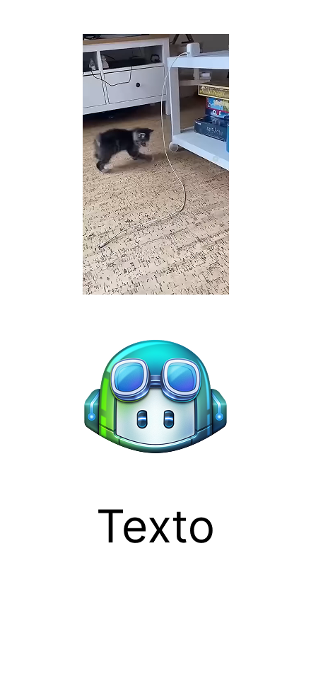

# Landing page Copilot

El objetivo de este sitio web es presentar el nuevo botón de vista previa desde las herramientas de chat de copilot de Microsoft.

## Colores de la marca

Colores primarios de la marca Microsoft Copilot:

- #1b88d8 azul
- #0cafe1 azul-marino
- #3ecfa6 verde
- #16bbc1 cyan
- #1c57db azul-oscuro

## Tipografía

Ésta landing page usa la fuente Roboto diseñada por Christian Robertson, Paratype, Font Bureau.

## Propósito (metodología de historia de usuario)

Quién: ¿Quién es el usuario objetivo?

Qué necesita: ¿Qué problema tiene o qué necesita resolver?

Qué ofrece tu producto: ¿Cómo lo ayudas de forma única?

Beneficio final: ¿Qué gana al usarlo?

Ejemplo de historia de usuario convertida en propósito:

"Como profesional independiente que pierde tiempo en tareas administrativas, quiero una herramienta que automatice mis reportes, para poder enfocarme en mis clientes."

## Diseño visual

https://www.figma.com/design/fMq5goW8fJEKEdJgL3tqEw/Copilot?node-id=0-1&t=OF69uTKAHD88roHS-1